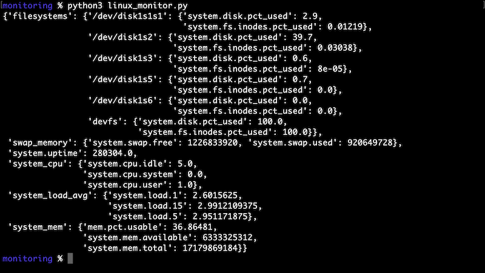
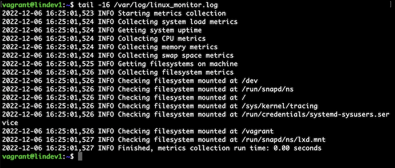

# System monitoring

* linux_monitor is a cron driven Python app that collects system usage data using the psutil module. It runs on Linux and other Unix-like machines.
* [linux_monitor.py](linux_monitor/linux_monitor.py) writes to /var/log/linux_monitor.json but could be easily modified to send metrics to an api.
* [linux_monitor_config.yml](linux_monitor/linux_monitor_config.yml) lists the system metrics to be collected. Other metrics can be added as needed.

### Deploy with Ansible
* The Ansible playbook in this repo can be used to create everything needed for linux_monitor to run including the cron and logroate entries. The playbook will also install the required Python modules and deploy the linux_monitor app itself.
* To install linux_monitor locally on a single machine, something like the following command could be used.
```shell script
ansible-playbook deploy_linux_monitor.yml --connection=local -i localhost, -e 'svc_user=ec2-user' -e 'ansible_python_interpreter=/usr/bin/python3'
```

### Deploy to AWS EC2
* linux_monitor can be deployed to an AWS EC2 instance installed with the AWS CodeDeploy agent. The deployment can be started with GitHub Actions using the workflow in this repo.
* The Ansible playbook mentioned above must be run initially on the EC2 instance. The playbook could be included in part of the pipeline if desired, but the GitHub workflow will always deploy the linux_monitor code.
* See this [Integrating with GitHub Actions](https://aws.amazon.com/blogs/devops/integrating-with-github-actions-ci-cd-pipeline-to-deploy-a-web-app-to-amazon-ec2/) document for reference on setting up the link between GitHub Actions and AWS.



